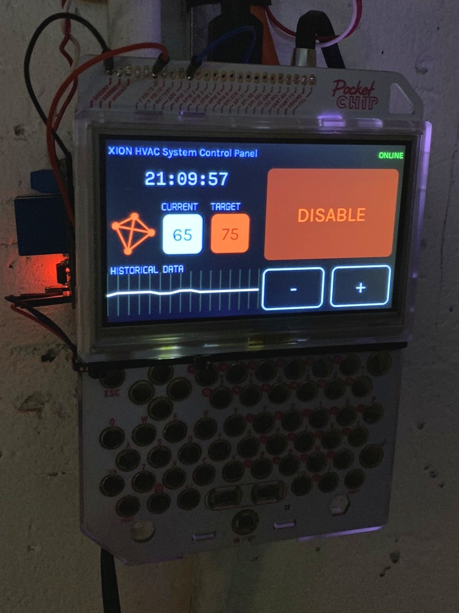

# Chipotherm
Chipotherm is a electronic thermostat for the [Pocket C.H.I.P.](https://en.wikipedia.org/wiki/CHIP_(computer)#Pocket_CHIP_and_Pockulus) computer. 



It supports automatic temperature monitoring, a temperature graph of past measurements, and a cool futuristic UI.

You can also control it remotely, either via a TCP socket or by installing the [Chipotherm Server](https://github.com/buzzert/CHIPotherm-Server).

## Building
Make sure to build with clang for C++14 support. 
(Ensure default c++ compiler with `update-alternatives --config c++`)

This project uses the Meson build system
```
meson build
ninja -C build
```

### Building for Pocket C.H.I.P.
The best way to build for the Pocket C.H.I.P. is via a QEMU root using Debian Jessie (the distribution the CHIP is using).

Here's how to set that up:
1. Make sure you're building on a 32-bit Debian-based system (in a VM for instance)
2. `mkdir /var/jessie_armhf`
3. Bootstrap an ARM Debian Jessie instance using `qemu-debootstrap`
    qemu-debootstrap --arch armhf jessie /var/jessie_armhf http://deb.debian.org/debian/
4. Copy the qemu interpreter to the new root
    cp /usr/bin/qemu-arm-static /var/jessie_armhf/usr/bin
5. `chroot` to the newly created debian root and install build dependencies in there. (See "Requirements" section)

## Installing
1. Copy the `chipotherm` executable to the Pocket C.H.I.P.
2. Setup a `systemd` job so chipotherm runs when the CHIP boots up [optional]

### Hardware Installation
3. Attach a electronic relay (such as [this one](https://www.amazon.com/WINGONEER-KY-019-Channel-Module-arduino/dp/B06XHJ2PBJ/ref=sr_1_3?ie=UTF8&qid=1549857207&sr=8-3&keywords=electronic+relay)) to the CHIP.
    a. Connect +3.3V to the VIN pin on the relay
    b. Connect ground to ground on the CHIP
    c. Connect `S` or whatever the signal pin is to the CHIP's `GPIO 1` pin
4. Attach the "hot" and "neutral" wires to the relay, such that when the relay is closed it completes the circuit between the two wires. It might be a good idea to test with a multi-meter before installing. A correct installation would be +240V (in the US) from the hot wire and +0V from the neutral wire. It is important that you do not connect these directly to the Pocket CHIP! You must use a relay!

## Remote Control
Chipotherm can be controlled remotely, either via messaging the UNIX socket it creates (located in /run/user/[your uid]/chipotherm/socket) or by running a command-and-control server such as [Chipotherm Server](https://github.com/buzzert/CHIPotherm-Server). 

To have Chipotherm connect to a command-and-control server, start the server on another box (such as a VPS), and start chipotherm providing the command-and-control server as the first argument. For example:
    `chipotherm 'http://myserver.local:43001'`

### Control via the socket
In the future, I'd like to provide a nicer interface for doing this, but for now you can message the socket using the `socat` command on Linux:
    `echo "set_enabled 1" | socat - UNIX-CONNECT:/var/run/user/1000/chipotherm/socket`


## Submodules
[bubbles](https://github.com/buzzert/bubbles) is used for the user interface for this project.

## Requirements
[libtempered](https://github.com/hbt/TEMPered)
[bubbles](https://github.com/buzzert/bubbles)
boost
hidapi-hidraw
libsoup-2.4
pangocairo
threads

